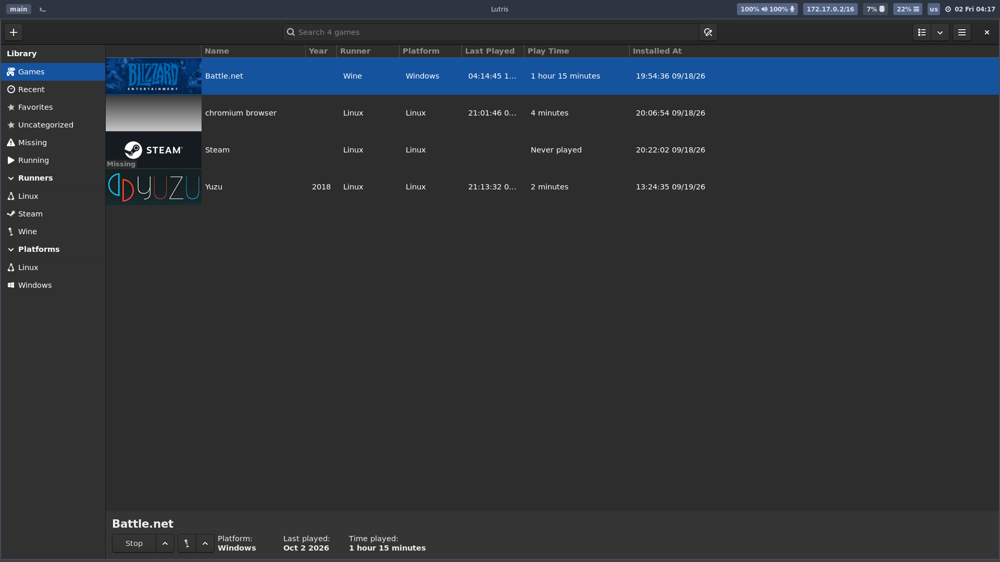

# gameonwhales-lutris-kaijuu

在 [Games-on-Whales](https://github.com/games-on-whales/gow) 的 `gameonwhales/lutris` 容器里，让 **Wine/Proton 程序（战网 Battle.net 等）的"使用浏览器完成网页验证"真正能打开浏览器**，并且**每次打开链接弹出浏览器选择窗口**，由你决定用哪个浏览器。

本仓库提供两种落地方式，可任选其一：

| 方式 | 适用 | 特点 |
|---|---|---|
| **镜像固化**（推荐） | 所有会话、重复部署 | 新会话开箱即用；带**开机自愈**，自动修复"浏览器抢默认" |
| **运行时安装** | 单个正在运行的会话 | 不用重建镜像，改持久卷即时生效 |

---

## 问题背景

战网（国服）登录会走「网易 mkey oauth」外部认证流程：

```
Battle.net (Wine)  →  winebrowser.exe  →  xdg-open  →  ???  →  浏览器
```

在 GOW 的 Lutris 容器里，这条链会断在三个地方（本仓库逐个解决）：

| 症状 | 根因 |
|---|---|
| 弹 **"Open With… / No Apps available"** | `~/.config/mimeapps.list` 指向的 `.desktop` 不存在（容器里根本没装浏览器） |
| 浏览器进程在跑，但**窗口看不到** | GTK/浏览器默认走 wayland-1，sway 不显示其窗口 |
| 浏览器打开 **"页面出错！"**，URL 里出现 `%u` | 脚本用 `cmd="${cmd//%u/$URL}"` 拼 URL，bash 把 URL 里的 `&` 当替换模式引用吃掉了 |
| 之前能弹选择器，**后来又不弹了** | Firefox 启动时把自己设为默认浏览器，覆写了 `mimeapps.list` |


---

## ⚠ 先读这一条：什么能固化、什么不能

Wolf 启动会话容器时会用卷**覆盖**下列路径：

```
/home/retro              整个家目录
/home/retro/.config      用户配置
/home/retro/.local       用户应用数据
/var/lutris              游戏库
/mnt/WD4/public          宿主共享盘
```

**写进镜像的这些路径会被挂载遮蔽、根本看不见。** 因此固化位置必须避开它们：

| 内容 | 位置 |
|---|---|
| 选择器脚本 | `/usr/local/bin/browser-picker` |
| URL handler 注册 | `/usr/share/applications/browser-picker.desktop` |
| 系统级默认 | `/etc/xdg/mimeapps.list` |
| 开机自愈钩子 | `/opt/gow/startup.d/90-browser-picker.sh` |

最后一项是必需的：用户级 `~/.config/mimeapps.list`（在卷里）优先级高于系统级，所以每次开机由钩子把它校正回选择器，并保留其他协议关联（如 `discord://`）。

---

## 方式一：镜像固化

```bash
# 构建（需要先把浏览器 AppImage 放到共享盘，见下文）
./build.sh                                  # → gameonwhales/lutris:kaijuu-picker

# 验证（会用全新卷模拟新会话，并预置一份"被 Firefox 改坏"的配置来测自愈）
./verify-image.sh gameonwhales/lutris:kaijuu-picker
```

让 Wolf 用这个镜像启动 Lutris 会话即可（把会话镜像名改成 `gameonwhales/lutris:kaijuu-picker`）。

`Dockerfile` 结构：

```dockerfile
FROM gameonwhales/lutris:edge
RUN apt-get update && apt-get install -y libglew-dev steam && rm -rf /var/lib/apt/lists/*   # 原 kaijuu 层
RUN apt-get update && apt-get install -y --no-install-recommends \
      zenity desktop-file-utils xdg-utils ca-certificates && ...                            # 选择器依赖
COPY context/browser-picker         /usr/local/bin/browser-picker
COPY context/browser-picker.desktop /usr/share/applications/browser-picker.desktop
COPY context/mimeapps.list          /etc/xdg/mimeapps.list
COPY context/90-browser-picker.sh   /opt/gow/startup.d/90-browser-picker.sh
```

---

## 方式二：运行时安装

```bash
./runtime/install-browser-picker.sh <容器名>     # 不传容器名则自动挑第一个 WolfLutris_*
```

幂等、自动探测共享盘上的浏览器、写完后**自检**（文件非空 / handler 解析 / 实际调起选择器）。容器重启后配置仍在持久卷里；若诊断工具丢失，跑：

```bash
./runtime/setup-tools.sh <容器名>
```

---

## 浏览器放哪

镜像**不打包浏览器**（体积大、且 Chrome/Edge 有再分发条款问题）。把 AppImage 放到宿主共享盘：

```
/mnt/WD4/public/software/linux/
├── firefox-149.0.r20260403140140-x86_64.AppImage
├── Chromium-stable-152.0.7977.64-x86_64.AppImage
├── Google-Chrome-stable-152.0.7977.64-1-x86_64.AppImage
└── Microsoft-Edge-stable-152.0.4191.53-1-x86_64.AppImage
```

该目录在容器内是同一路径（`/mnt/WD4/public/software/linux/`），且**不随容器重启丢失**。

> 文件需要有执行位（`chmod +x`）；容器内跑 chromium 系必须 `--no-sandbox`；Firefox 必须 `MOZ_ENABLE_WAYLAND=0`（脚本已内置）。

### 增删浏览器（不用重建镜像）

在容器里写 `~/.config/browser-picker.conf`（持久卷内）：

```bash
APP_DIR=/mnt/WD4/public/software/linux
BROWSERS=(
  "Brave|Brave.AppImage --no-sandbox --new-window"
  "Firefox|firefox-149.0.r20260403140140-x86_64.AppImage --new-window --no-default-browser-check"
)
```

想固定用某个浏览器、不要选择器：把 `~/.config/mimeapps.list` 里三个键改成该浏览器的 `.desktop`，并 `touch ~/.config/browser-picker.no-autofix` 停用自愈。

---

## 效果

| 选择器 | 选中后打开登录页 |
|---|---|
|  |  |

---

## 实现要点（踩过的坑）

1. **xdg-open 原生不会弹"选浏览器"窗口**：有默认 handler 就直接开；此容器里 `xdg-desktop-portal-gtk` 的 `UseIn=gnome` 不匹配 sway，AppChooser 列表为空。→ 自建 zenity 选择器。
2. **GTK 弹窗默认不显示**：进程活着但窗口不在 sway/X11 树里。→ `GDK_BACKEND=x11`（必要时 `XAUTHORITY=/run/pressure-vessel/Xauthority`，该路径只存在于战网的 pressure-vessel 命名空间内）。
3. **URL 传参绝不用字符串替换**：`${cmd//%u/$URL}` 会把 URL 里的 `&` 换成 `%u`。→ 必须数组传参：
   ```bash
   read -r -a CMD_ARGS <<< "$cmd"
   exec "$APP_DIR/${CMD_ARGS[0]}" "${CMD_ARGS[@]:1}" "$URL"
   ```
   （注意：`.desktop` 文件里的 `%u` 是**正确**用法，由桌面环境替换、不经过 bash；只有脚本内拼接才必须避免。）
4. **Firefox/Chrome 会抢默认浏览器**：首次启动覆写 `mimeapps.list`。→ 加 `--no-default-browser-check`，并由启动钩子每次开机校正。
5. **`docker exec` 默认不转发 stdin**：`docker exec sh -c "cat > f" <<EOF` 会写出 **0 字节空文件**且不报错。→ 加 `-i`，并校验文件非空。
6. **`docker run -v` 的路径由宿主机解析**：在容器里执行 docker 命令时，`-v` 必须给宿主路径（用 `docker inspect "$(hostname)"` 查映射）。`verify-image.sh` 内置了自动换算。
7. **`retro` 用户是运行时创建的**（`/etc/cont-init.d/10-setup_user.sh`，会先删掉基础镜像里 uid=1000 的 `ubuntu`）。裸 `--entrypoint bash` 里 `gosu retro` 会失败，验证脚本改为直接 source 真实的 cont-init 脚本。
8. **容器 locale 是 POSIX**：中文传给 zenity 会 `Invalid byte sequence`，故选择器界面用英文。
9. **Wolf 会话容器根文件系统重启即重置**：apt 装的东西全丢（配置在持久卷里不受影响）。
10. **截图技巧**：sway 的 wayland-1 不支持 `wlr-screencopy`，`grim` 用不了；但 **wayland-2 可以** —— `WAYLAND_DISPLAY=wayland-2 grim -l 0 out.png`。

---

## 目录结构

```
├── Dockerfile                 # 镜像固化：FROM edge + 原 kaijuu 层 + 选择器层 + 构建期自检
├── context/                   # ↑ 的构建上下文
│   ├── browser-picker         #   选择器脚本（→ /usr/local/bin）
│   ├── browser-picker.desktop #   handler 注册（→ /usr/share/applications）
│   ├── mimeapps.list          #   系统级默认（→ /etc/xdg）
│   └── 90-browser-picker.sh   #   开机自愈钩子（→ /opt/gow/startup.d）
├── build.sh                   # 构建（含上下文自检）
├── verify-image.sh            # 全新卷 + 旧配置自愈验证
├── runtime/                   # 运行时方案（不改镜像）
│   ├── install-browser-picker.sh
│   ├── browser-picker.standalone.sh
│   └── setup-tools.sh
├── docs/
│   ├── AI-PROMPT-zh.md        # 可直接喂给 AI 的完整排障/部署提示词
│   ├── RUNTIME-DEPLOY-zh.md   # 运行时部署与容器内改动清单
│   └── TROUBLESHOOTING-zh.md  # 四次故障的完整定位过程
└── screenshots/
```

## 验证过的环境

- 基础镜像 `gameonwhales/lutris:edge`，运行镜像 `gameonwhales/lutris:kaijuu`（Ubuntu 25.04）
- 显示：sway（`wayland-1`）+ Xwayland `:0`，Wine 走 `wayland-2`
- 战网：lutris + umu + Proton 11.0（`WINEPREFIX=/var/lutris/Games/battlenet/pfx/`）

## 已知限制

- 选择器界面为英文（容器 locale 为 POSIX）
- 浏览器本体不进镜像，依赖共享盘 `/mnt/WD4/public`
- 首次构建会重跑 kaijuu 的 `libglew-dev + steam` 层（原 Dockerfile 空白字符差异导致缓存不匹配，约 2–3 分钟）；想快速迭代可临时把 `FROM` 改成 `gameonwhales/lutris:kaijuu`
