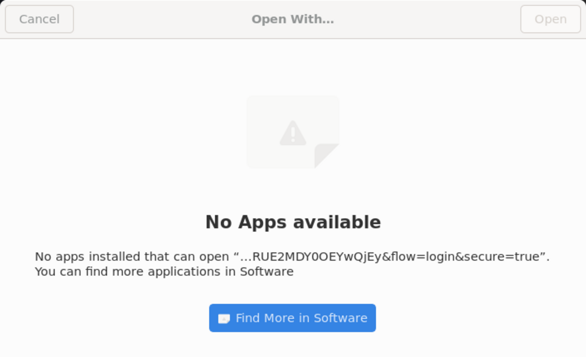
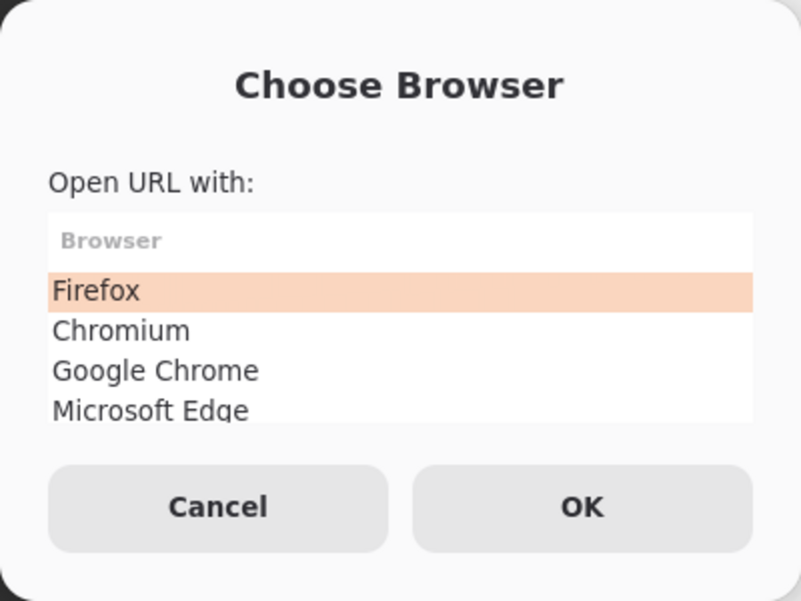
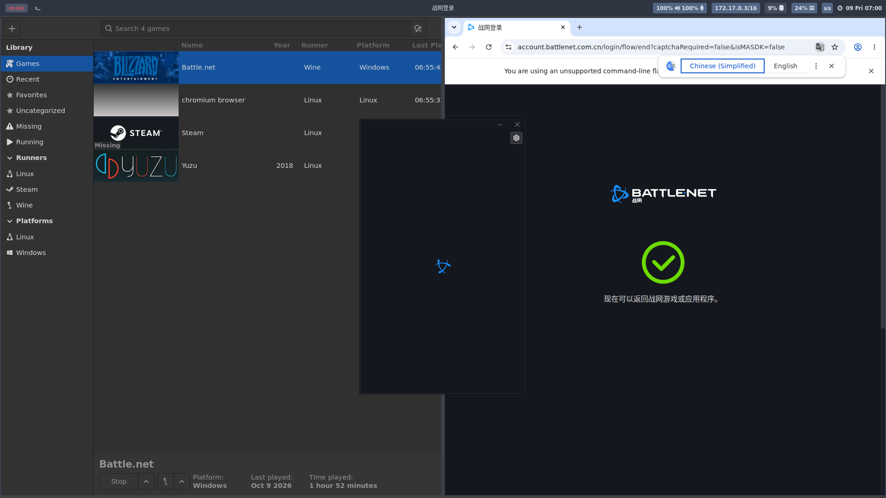

# gameonwhales-lutris-kaijuu

在 [Games-on-Whales](https://github.com/games-on-whales/gow) 的 `gameonwhales/lutris` 容器里，让 **Wine/Proton 程序（战网 Battle.net 等）的"使用浏览器完成网页验证"真正能打开浏览器**，并且**每次打开链接弹出浏览器选择窗口**，由你决定用哪个浏览器。

本仓库提供两种落地方式，可任选其一（都包含下面两处关键修复）：

| 方式 | 适用 | 特点 |
|---|---|---|
| **镜像固化**（推荐） | 所有会话、重复部署 | 新会话开箱即用；带**开机自愈**与自动启动桥接 |
| **运行时安装** | 单个正在运行的会话 | 不用重建镜像，改持久卷即时生效 |

---

## 问题背景：这条链会断在三个地方

战网（国服）登录会走「网易 mkey oauth」外部认证流程：

```
Battle.net (Wine)  →  winebrowser.exe  →  xdg-open  → 浏览器
```

| # | 症状 | 根因 |
|---|---|---|
| 1 | 弹 **"Open With… / No Apps available"** | `~/.config/mimeapps.list` 指向的 `.desktop` 不存在（容器里根本没装浏览器） |
| 2 | 浏览器进程在跑但**窗口看不到** | GTK/浏览器默认走 wayland-1，sway 不显示其窗口 |
| 3 | 浏览器打开 **"页面出错！"**，URL 里出现 `%u` | 脚本用 `cmd="${cmd//%u/$URL}"` 拼 URL，bash 把 URL 里的 `&` 当替换模式引用吃掉了 |
| 4 | 之前能弹选择器，**后来又不弹了** | Firefox 启动时把自己设为默认浏览器，覆写了 `mimeapps.list` |
| 5 | **点了没任何反应，浏览器根本不出现** | 战网跑在 umu/Proton 的 **pressure-vessel 沙箱**内，沙箱里的 `/usr/bin/xdg-open` 是指向 `steam-runtime-urlopen` 的软链，只会尝试 Steam 管道与 D-Bus portal，本环境两者都不可用 → `Unable to open URL` |
| 6 | 选择器弹出来了，选完**浏览器却没启动** | 容器环境里已存在 `APP_DIR=/opt/gow/app`（GOW 自用），脚本若用 `${APP_DIR:-默认}` 会被污染，去错误目录找浏览器 |



---

## ⚠ 两条必须先理解的约束

### 约束一：什么能固化、什么不能

Wolf 启动会话容器时会用卷**覆盖**下列路径：

```
/home/retro              整个家目录
/home/retro/.config      用户配置
/home/retro/.local       用户应用数据
/var/lutris              游戏库
/mnt/WD4/public          宿主共享盘
```

**写进镜像的这些路径会被挂载遮蔽、根本看不见。** 因此固化位置必须避开它们：

| 内容 | 位置 |
|---|---|
| 选择器脚本 | `/usr/local/bin/browser-picker` |
| URL handler 注册 | `/usr/share/applications/browser-picker.desktop` |
| 系统级默认 | `/etc/xdg/mimeapps.list` |
| 开机自愈钩子 | `/opt/gow/startup.d/90-browser-picker.sh` |
| 桥接守护进程 / 启动脚本 | `/usr/local/bin/url-bridge-*.sh` |
| 沙箱代理源文件 | `/usr/local/share/url-bridge/xdg-open-sandbox-proxy` |
| 桥接启动钩子 | `/opt/gow/startup.d/91-url-bridge.sh` |

用户级 `~/.config/mimeapps.list`（在卷里）优先级高于系统级，所以每次开机由钩子把它校正回选择器，并保留其他协议关联（如 `discord://`）。

### 约束二：pressure-vessel 沙箱里的 `xdg-open` 是个陷阱

战网进程的 `PATH` 第一项是 Proton 的 bin 目录，而沙箱里的 `/usr/bin/xdg-open`
被替换成了 `steam-runtime-urlopen`：

```
$ nsenter -t <battle.net pid> -m -- xdg-open https://example.com
steam-runtime-urlopen: Unable to open URL
steam-runtime-urlopen: tried using steam.pipe, received error: Steam is not running
steam-runtime-urlopen: tried using xdg-desktop-portal, received error: Unable to connect to D-Bus session bus
```

也就是说：**你在容器里配得再好的 mimeapps / 选择器，沙箱内的战网也永远不会用到。**
而沙箱内又没有 zenity、也加载不了容器库（`/run/host/usr/bin/zenity` 会因缺 `libadwaita` 失败），无法就地弹窗。

因此本仓库用一个**跨沙箱桥接**：

```
沙箱内 winebrowser → Proton bin/xdg-open（我们的代理）
        │  把 URL 写进共享 FIFO（O_RDWR 打开，不阻塞）
        ▼
容器内 url-bridge-daemon.sh（沙箱外）
        │  读取 FIFO
        ▼
browser-picker → zenity 选择窗 → 浏览器
```



---

## 方式一：镜像固化

```bash
./build.sh                                            # → gameonwhales/lutris:kaijuu-picker
./verify-image.sh gameonwhales/lutris:kaijuu-picker    # 全新卷 + 旧配置自愈验证
```

让 Wolf 用这个镜像启动 Lutris 会话即可（会话镜像名改成 `gameonwhales/lutris:kaijuu-picker`）。
启动钩子会在会话开始时自动部署沙箱代理并拉起桥接守护进程。

## 方式二：运行时安装

```bash
./runtime/install-browser-picker.sh <容器名>   # 选择器 + .desktop + mimeapps（幂等 + 自检）
./sandbox-bridge/install-bridge.sh  <容器名>   # 沙箱桥接：代理 + 守护进程 + sway 自启
./runtime/setup-tools.sh            <容器名>   # 可选：诊断工具（容器重启后需重装）
```

安装后配置全部落在持久卷，容器重启仍生效；sway 通过 `~/.config/sway/custom-cfg`
在每次会话启动时自动重建代理并重启守护进程。

---

## 浏览器放哪

镜像**不打包浏览器**（体积大、且 Chrome/Edge 有再分发条款问题）。把 AppImage 放到宿主共享盘：

```
/mnt/WD4/public/software/linux/
├── firefox-149.0.r20260403140140-x86_64.AppImage
├── Chromium-stable-152.0.7977.64-x86_64.AppImage
├── Google-Chrome-stable-152.0.7977.64-1-x86_64.AppImage
└── Microsoft-Edge-stable-152.0.4191.53-1-x86_64.AppImage
```

该目录在容器内是同一路径，且**不随容器重启丢失**。文件需要有执行位（`chmod +x`）；
容器内跑 chromium 系必须 `--no-sandbox`；Firefox 必须 `MOZ_ENABLE_WAYLAND=0`（脚本已内置）。

选择器会做**模糊匹配**：即使浏览器升级换了文件名（如 `firefox-150…`），也能自动找到。

### 增删浏览器（不用重建镜像）

在容器里写 `~/.config/browser-picker.conf`（持久卷内）：

```bash
PICKER_APP_DIR=/mnt/WD4/public/software/linux     # 注意用 PICKER_APP_DIR，不要用 APP_DIR
BROWSERS=(
  "Brave|Brave.AppImage --no-sandbox --new-window"
  "Firefox|firefox-149.0.r20260403140140-x86_64.AppImage --new-window --no-default-browser-check"
)
```

想固定用某个浏览器、不要选择器：把 `~/.config/mimeapps.list` 里三个键改成该浏览器的
`.desktop`，并 `touch ~/.config/browser-picker.no-autofix` 停用自愈。

---

## 效果

| 选择器 | 选中后完成登录 |
|---|---|
|  |  |

---

## 实现要点（踩过的坑）

1. **xdg-open 原生不会弹"选浏览器"窗口**：有默认 handler 就直接开；此容器里 `xdg-desktop-portal-gtk` 的 `UseIn=gnome` 不匹配 sway，AppChooser 列表为空。→ 自建 zenity 选择器。
2. **GTK 弹窗默认不显示**：进程活着但窗口不在 sway/X11 树里。→ `GDK_BACKEND=x11`（必要时 `XAUTHORITY=/run/pressure-vessel/Xauthority`）。
3. **URL 传参绝不用字符串替换**：`${cmd//%u/$URL}` 会把 URL 里的 `&` 换成 `%u`。→ 必须数组传参：
   ```bash
   read -r -a CMD_ARGS <<< "$cmd"
   exec "$PICKER_APP_DIR/${CMD_ARGS[0]}" "${CMD_ARGS[@]:1}" "$URL"
   ```
   （`.desktop` 里的 `%u` 是**正确**用法，由桌面环境替换、不经过 bash；只有脚本内拼接才必须避免。）
4. **Firefox/Chrome 会抢默认浏览器**：首次启动覆写 `mimeapps.list`。→ 加 `--no-default-browser-check`，并由启动钩子每次开机校正。
5. **pressure-vessel 沙箱内的 xdg-open 是 `steam-runtime-urlopen`**（见上文约束二）。→ 跨沙箱 FIFO 桥接。
6. **`APP_DIR` 环境变量被 GOW 占用**（`APP_DIR=/opt/gow/app`）。→ 脚本一律用私有变量名 `PICKER_APP_DIR`。
7. **`docker exec` 默认不转发 stdin**：`docker exec sh -c "cat > f" <<EOF` 会写出 **0 字节空文件**且不报错。→ 加 `-i`，并校验文件非空。
8. **`docker run -v` 的路径由宿主机解析**：在容器里执行 docker 命令时，`-v` 必须给宿主路径（用 `docker inspect "$(hostname)"` 查映射）。`verify-image.sh` 内置了自动换算。
9. **`retro` 用户是运行时创建的**（`/etc/cont-init.d/10-setup_user.sh`，会先删掉基础镜像里 uid=1000 的 `ubuntu`）。裸 `--entrypoint bash` 里 `gosu retro` 会失败。
10. **容器 locale 是 POSIX**：中文传给 zenity 会 `Invalid byte sequence`，故选择器界面用英文。
11. **Wolf 会话容器根文件系统重启即重置**：apt 装的东西全丢（持久卷内的配置不受影响）。
12. **截图技巧**：sway 的 wayland-1 不支持 `wlr-screencopy` 时用不了 `grim`，但**推流画面所在的 wayland socket 可以**（本机曾为 wayland-2，后变为 wayland-1）：
    ```bash
    WAYLAND_DISPLAY=wayland-1 grim -l 0 out.png
    ```
13. **用 `pkill -f` 时小心自杀**：模式若出现在自己的命令行里，会把当前 shell 一起杀掉。→ 用 `pkill -x <进程名>` 或按 pidfile 杀。

---

## 目录结构

```
├── Dockerfile                     # 镜像固化：FROM edge + 原 kaijuu 层 + 选择器层 + 桥接层 + 构建期自检
├── context/                       # ↑ 的构建上下文
│   ├── browser-picker             #   选择器脚本（→ /usr/local/bin）
│   ├── browser-picker.desktop     #   handler 注册（→ /usr/share/applications）
│   ├── mimeapps.list              #   系统级默认（→ /etc/xdg）
│   ├── 90-browser-picker.sh       #   开机自愈钩子（→ /opt/gow/startup.d）
│   └── 91-url-bridge.sh           #   桥接启动钩子（→ /opt/gow/startup.d）
├── sandbox-bridge/                # 跨 pressure-vessel 沙箱的 URL 桥接（两种方式共用）
│   ├── xdg-open-sandbox-proxy     #   沙箱内代理（写 FIFO）
│   ├── url-bridge-daemon.sh       #   沙箱外守护进程（读 FIFO → 选择器）
│   ├── url-bridge-start.sh        #   部署代理 + 重启守护进程（幂等）
│   ├── sway-custom-cfg            #   运行时装法的 sway 自启片段
│   └── install-bridge.sh          #   一键装进运行中的容器
├── build.sh                       # 构建（含上下文自检）
├── verify-image.sh                # 全新卷 + 旧配置自愈验证
├── runtime/                       # 运行时方案（不改镜像）
│   ├── install-browser-picker.sh
│   ├── browser-picker.sh
│   └── setup-tools.sh
├── docs/
│   ├── AI-PROMPT-zh.md            # 可直接喂给 AI 的完整排障/部署提示词
│   ├── RUNTIME-DEPLOY-zh.md       # 运行时部署与容器内改动清单
│   └── TROUBLESHOOTING-zh.md      # 故障定位全过程（含 pressure-vessel 陷阱）
└── screenshots/
```

## 排障速查

```bash
C=<容器名>

# 桥接是否在跑 / 是否收到 URL
docker exec -u retro $C tail -20 /tmp/url-bridge.log

# 沙箱内 xdg-open 解析到谁（应为 Proton bin 下的代理）
P=$(docker exec $C pgrep -f Battle.net.exe | head -1)
B=$(docker exec $C sh -c 'ls -d ~/.steam/debian-installation/steamapps/common/Proton*/files/bin|head -1')
docker exec $C nsenter -t $P -m -- env PATH="$B:/usr/bin:/bin" sh -c 'command -v xdg-open'

# 沙箱内手动触发一次（应弹出 Choose Browser）
docker exec $C nsenter -t $P -m -- env PATH="$B:/usr/bin:/bin" HOME=/home/retro xdg-open https://example.com

# 选择器自身是否正常
docker exec -u retro $C /home/retro/.local/bin/browser-picker https://example.com
```

## 验证过的环境

- 基础镜像 `gameonwhales/lutris:edge`，运行镜像 `gameonwhales/lutris:kaijuu`（Ubuntu 25.04）
- 显示：sway + Xwayland `:0`；Wine 走 `wayland-*`
- 战网：lutris + umu + Proton 11.0（`WINEPREFIX=/var/lutris/Games/battlenet/pfx/`）
- 实测结果：浏览器打开战网登录页 → 登录完成，页面提示"现在可以返回战网游戏或应用程序"

## 已知限制

- 选择器界面为英文（容器 locale 为 POSIX）
- 浏览器本体不进镜像，依赖共享盘 `/mnt/WD4/public`
- 桥接依赖 Proton 的 bin 目录在 PATH 首位；Proton 大版本更新后由启动脚本自动重装代理
- 首次构建会重跑 kaijuu 的 `libglew-dev + steam` 层（原 Dockerfile 空白字符差异导致缓存不匹配，约 2–3 分钟）；想快速迭代可临时把 `FROM` 改成 `gameonwhales/lutris:kaijuu`
